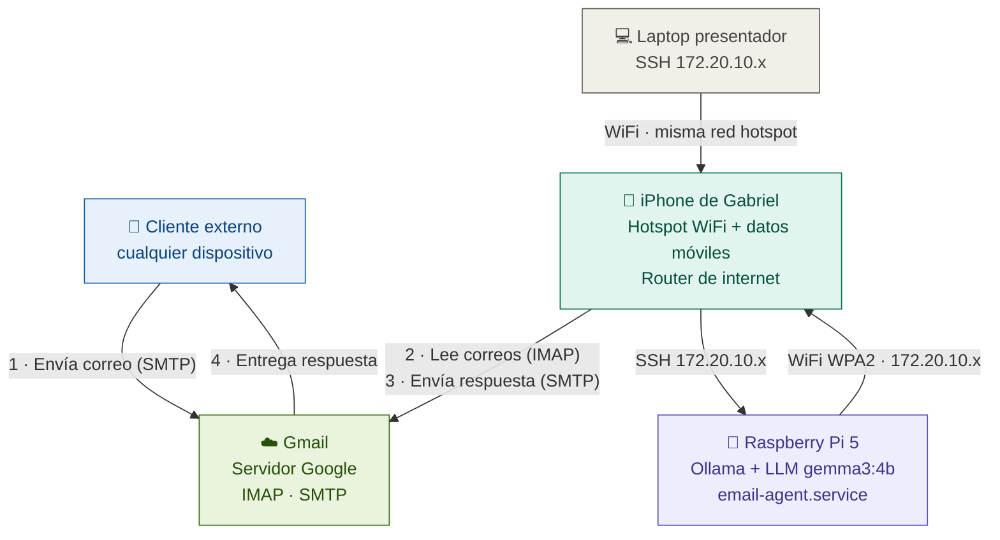

# Demostración práctica

Se usa una Raspberry Pi 5 de 8 GB de RAM. Se crea una imagen personalizada usando Yocto Scarthgap dentro de un contenedor Docker. La imagen es de consola, sin interfaz gráfica. Incluye acceso por SSH sin contraseña, autologin al encender, conectividad WiFi para hotspot de celular, un LLM local corriendo con Ollama, y un agente que lee correos de Gmail y responde automáticamente como asistente de ventas de una tienda de electrónica.

---

## Arquitectura del sistema

La Pi no tiene conexión directa a internet. Todo el tráfico hacia Gmail pasa a través del iPhone, que actúa como router mediante el hotspot de datos móviles. La laptop del presentador se conecta al mismo hotspot para acceder a la Pi por SSH.



---

## Creación del contenedor Docker

El setup está dividido en tres archivos que trabajan juntos:

- **`Dockerfile`**: instala las dependencias del sistema y copia los scripts.
- **`setup.sh`**: clona Poky y las capas, registra las capas en BitBake, crea la capa `meta-ai` y escribe todas las recetas y archivos de configuración.
- **`entrypoint.sh`**: se ejecuta cada vez que arranca el contenedor. La primera vez que el contenedor arranca con el volumen vacío, ejecuta `setup.sh` automáticamente — los archivos quedan en el directorio del host y son visibles desde el administrador de archivos. Las veces siguientes detecta que el workspace ya existe y abre bash directamente.

```bash
mkdir yocto-pi5-project
cd yocto-pi5-project
# Colocar aquí Dockerfile, setup.sh y entrypoint.sh
```

### `Dockerfile`

Solo instala dependencias del sistema. El clonado y la configuración ocurren en el primer arranque, directamente dentro del volumen montado del host.

```dockerfile
# Imagen base: Ubuntu 22.04 LTS
FROM ubuntu:22.04

# Evita que apt lance preguntas interactivas durante la instalación
# de paquetes.
ENV DEBIAN_FRONTEND=noninteractive

# Instala todas las dependencias que Yocto necesita para compilar.
RUN apt-get update && apt-get install -y \
    gawk wget git diffstat unzip texinfo gcc build-essential chrpath \
    socat cpio python3 python3-pip python3-pexpect xz-utils debianutils \
    iputils-ping python3-git python3-jinja2 libegl-mesa0 libsdl1.2-dev \
    pylint xterm python3-subunit mesa-common-dev zstd liblz4-tool \
    python3-distutils curl locales sudo vim tmux file mc \
    && rm -rf /var/lib/apt/lists/*

# Yocto requiere un locale UTF-8 configurado correctamente.
# Configuran el idioma y la codificación de los caracteres
RUN locale-gen en_US.UTF-8
ENV LANG=en_US.UTF-8
ENV LC_ALL=en_US.UTF-8

# Yocto no puede correr como root por razones de seguridad.
# Se crea un usuario normal llamado yoctouser con UID/GID 1000,
# que coincide con el UID típico del usuario del host en Linux.
ARG USERNAME=yoctouser
ARG USER_UID=1000
ARG USER_GID=1000

RUN groupadd --gid $USER_GID $USERNAME \
    # Crea el usuario con home en /home/yoctouser y shell bash
    && useradd --uid $USER_UID --gid $USER_GID -m -s /bin/bash $USERNAME \
    # Permisos sudo sin contraseña: necesario para algunos pasos del build
    && echo "$USERNAME ALL=(ALL) NOPASSWD:ALL" > /etc/sudoers.d/$USERNAME \
    # 0440: el archivo de sudoers debe ser solo lectura para funcionar
    && chmod 0440 /etc/sudoers.d/$USERNAME

# Copia los scripts al home del usuario, fuera del volumen montado.
# --chown=yoctouser:yoctouser asegura que el usuario tenga permisos
# de lectura y ejecución sobre sus propios scripts.
COPY --chown=yoctouser:yoctouser setup.sh     /home/yoctouser/setup.sh
COPY --chown=yoctouser:yoctouser entrypoint.sh /home/yoctouser/entrypoint.sh

# Hace ambos scripts ejecutables.
RUN chmod +x /home/yoctouser/setup.sh /home/yoctouser/entrypoint.sh

# Cambia al usuario sin privilegios para el resto del build.
USER yoctouser

# Directorio de trabajo del contenedor: donde vive el workspace de Yocto.
WORKDIR /home/yoctouser/yocto-workspace

# El entrypoint se ejecuta cada vez que se arranca el contenedor.
# Detecta si es el primer arranque (volumen vacío) y ejecuta el setup,
# o inicializa el entorno de Yocto y abre bash si ya está configurado.
ENTRYPOINT ["/home/yoctouser/entrypoint.sh"]
```

---

### `entrypoint.sh`

Se ejecuta en cada arranque del contenedor. Detecta si el workspace ya existe para decidir si hace el setup o abre bash directamente.

```bash
#!/bin/bash
# ================================================================
#  entrypoint.sh — Se ejecuta cada vez que arranca el contenedor.
#
#  Primera vez (volumen vacío, sin carpeta poky/):
#    Ejecuta setup.sh que clona Poky y las capas, registra las capas,
#    crea meta-ai y escribe todas las recetas directamente en el
#    volumen del host. Al terminar, todo es visible desde el
#    administrador de archivos del host en yocto-workspace/.
#
#  Veces siguientes (poky/ ya existe):
#    Salta el setup, inicializa el entorno de Yocto y abre bash
#    con el entorno listo para correr bitbake directamente.
# ================================================================

WORKSPACE=/home/yoctouser/yocto-workspace

if [ ! -d "$WORKSPACE/poky" ]; then
    echo "========================================================"
    echo "  Primera ejecución: configurando el workspace..."
    echo "  Clonando repos y creando recetas. Tarda varios minutos."
    echo "========================================================"
    /home/yoctouser/setup.sh
    echo "========================================================"
    echo "  Setup completo."
    echo "  Copia los binarios pesados y luego corre:"
    echo "  bitbake core-image-base"
    echo "========================================================"
else
    echo ">>> Workspace ya configurado. Iniciando entorno de Yocto..."
fi

# Inicializa el entorno de Yocto: agrega BitBake al PATH y define
# las variables de entorno necesarias para compilar.
# Después del >, lo que hace es suprimir el mensaje impreso por Yocto
cd $WORKSPACE/poky
source oe-init-build-env build > /dev/null 2>&1

# Abre bash interactivo con el entorno ya inicializado.
# El usuario puede correr bitbake directamente al entrar.
exec /bin/bash
```

---

### `setup.sh`

Configura todo el workspace en el primer arranque. Usa **rutas absolutas en todo** para ser inmune a errores de directorio de trabajo. Los archivos de recetas se escriben con heredocs usando el delimitador entre comillas simples (`'EOF'`) para que bash no interprete el contenido.

El script realiza siete pasos en orden:

1. Clona Poky, meta-raspberrypi y meta-openembedded
2. Inicializa el entorno de build con `source oe-init-build-env`
3. Verifica que los clones quedaron bien antes de continuar
4. Registra todas las capas en bblayers.conf
5. Crea la estructura de directorios de meta-ai
6. Escribe todos los archivos de recetas, configuración y servicios
7. Escribe local.conf con la configuración final

---

## Preparación de los archivos binarios

Antes de compilar hay que preparar dos archivos en el **host** (fuera del contenedor). Son los únicos archivos que no se crean automáticamente porque son demasiado pesados.

### Descargar el binario de Ollama


```bash
# Descargar Ollama v0.22.1 para ARM64 (formato .tar.zst)
wget https://github.com/ollama/ollama/releases/download/v0.22.1/ollama-linux-arm64.tar.zst

ls -lh ollama-linux-arm64.tar.zst
# Debe pesar ~1.2 GB
```

### Descargar y empaquetar el modelo gemma3:4b

Se usa `gemma3:4b` como modelo de lenguaje.

```bash
# Instala Ollama en el host para poder descargar el modelo
curl -fsSL https://ollama.com/install.sh | sh

# Descargar gemma3:4b (~2.6 GB)
ollama pull gemma3:4b
ollama list   # verificar que aparece gemma3:4b

# Empaquetar el modelo con la estructura que Ollama espera en la Pi
# El tar.gz contendrá models/blobs/ y models/manifests/
sudo tar -czvf gemma3-4b-prebaked.tar.gz \
    -C /usr/share/ollama/.ollama models
```

---

## Construcción y primer arranque

```bash
# Construye la imagen Docker — solo instala paquetes del sistema
docker build -t yocto-builder-pi5 .

# Crea la carpeta que se montará como volumen
mkdir -p yocto-workspace

# Primer arranque: entrypoint.sh detecta el volumen vacío y ejecuta
# setup.sh automáticamente. Al terminar, todo es visible en yocto-workspace/
# Monta un volumen — conecta una carpeta del host con una carpeta del contenedor.
docker run -it --name yocto-ia-pi5 \
  -v $(pwd)/yocto-workspace:/home/yoctouser/yocto-workspace \
  yocto-builder-pi5

# Para volver a entrar en sesiones posteriores
docker start yocto-ia-pi5
docker exec -it yocto-ia-pi5 /bin/bash
```

---

## Estructura de la capa personalizada

```
meta-ai/
├── conf/
│   └── layer.conf
├── recipes-ai/
│   ├── email-agent/
│   │   ├── email-agent_1.0.bb
│   │   └── files/
│   │       ├── agent.py
│   │       ├── config.env
│   │       ├── email-agent.service
│   │       └── store_info.md
│   └── ollama/
│       ├── ollama_1.0.bb
│       └── files/
│           ├── ollama-linux-arm64.tar.zst  ← copiar manualmente
│           ├── ollama.service
│           └── qwen3-4b-prebaked.tar.gz    ← copiar manualmente
└── recipes-core/
    ├── autologin/
    │   ├── autologin_1.0.bb
    │   └── files/
    │       └── autologin.conf
    ├── images/
    │   └── core-image-base.bbappend
    └── show-ip/
        ├── show-ip_1.0.bb
        └── files/
            └── 99-show-ip.sh
```

---

## Contenido de los archivos

### `ollama_1.0.bb`

Instala el binario de Ollama v0.22.1 y los pesos del modelo gemma3:4b.

```bash
SUMMARY = "Ollama local AI model runner con gemma3:4b preinstalado"
LICENSE = "MIT"
LIC_FILES_CHKSUM = "file://${COMMON_LICENSE_DIR}/MIT;md5=0835ade698e0bcf8506ecda2f7b4f302"

SRC_URI = " \
    file://ollama-linux-arm64.tar.zst;subdir=ollama-release \
    file://ollama.service \
    file://gemma3-4b-prebaked.tar.gz;unpack=0 \
"
# subdir=ollama-release: extrae el tar.zst en su propia carpeta
# unpack=0 en el modelo: se extrae manualmente para controlar el destino

S = "${WORKDIR}"

inherit systemd

SYSTEMD_SERVICE:${PN} = "ollama.service"
# enable: el servicio arranca automáticamente en cada boot
SYSTEMD_AUTO_ENABLE:${PN} = "enable"

do_install() {
    # Crea el directorio /usr/bin/ dentro del staging si no existe.
    install -d ${D}${bindir}
    
    # Copia el binario de Ollama al staging en /usr/bin/ollama.
    # -m 0755 establece los permisos: el dueño puede leer/escribir/ejecutar,
    # el resto solo puede leer y ejecutar. Necesario para que sea ejecutable.
    install -m 0755 ${WORKDIR}/ollama-release/bin/ollama ${D}${bindir}/ollama

    # Crea el directorio de unidades systemd dentro del staging.
    install -d ${D}${systemd_system_unitdir}
    
    # Copia el archivo ollama.service al directorio de systemd en el staging.
    # -m 0644: el dueño puede leer/escribir, el resto solo puede leer.
    install -m 0644 ${WORKDIR}/ollama.service ${D}${systemd_system_unitdir}/

    # Extrae el tar.gz del modelo directamente en /root/.ollama/ del staging.
    # Esto "hornea" los pesos del modelo dentro de la imagen — al arrancar
    # la Pi, el modelo ya está disponible sin necesitar descargarlo.
    install -d ${D}/root/.ollama
    tar --no-same-owner -xzf ${WORKDIR}/gemma3-4b-prebaked.tar.gz \
        -C ${D}/root/.ollama/
}

FILES:${PN} += " \
    ${bindir}/ollama \
    ${systemd_system_unitdir}/ollama.service \
    /root/.ollama/ \
"

# El binario viene precompilado y sin símbolos de debug
INSANE_SKIP:${PN} = "already-stripped"
```

---

### `ollama.service`

Le dice a systemd cómo arrancar Ollama: cuándo hacerlo, con qué usuario y qué variables de entorno necesita. Las variables `HOME` y `OLLAMA_MODELS` son críticas: cuando Ollama corre como servicio systemd no hereda el entorno del usuario, y sin ellas no encuentra los modelos aunque estén instalados.

Ubicación: `meta-ai/recipes-ai/ollama/files/ollama.service`

```ini
[Unit]
Description=Ollama Service
# Arranca después de que la red esté operativa
After=network-online.target
Wants=network-online.target

[Service]
ExecStart=/usr/bin/ollama serve
User=root

# Ollama busca los modelos en $HOME/.ollama/models
# Un servicio systemd no hereda HOME del usuario — hay que definirlo explícitamente
Environment=HOME=/root

# Ruta explícita a los modelos como refuerzo adicional
Environment=OLLAMA_MODELS=/root/.ollama/models

# Escucha en todas las interfaces: permite consultar la API desde la red local
Environment=OLLAMA_HOST=0.0.0.0:11434

# Sin límite de tiempo para detener: un modelo cargado puede tardar en terminar
TimeoutStopSec=infinity

Restart=always
RestartSec=5

[Install]
WantedBy=multi-user.target
```

---

### `autologin_1.0.bb`

Esta receta instala el drop-in de systemd para getty que produce el autologin de root. Al no tener interfaz gráfica, el autologin simplemente lleva al prompt de consola directamente.

Ubicación: `meta-ai/recipes-core/autologin/autologin_1.0.bb`

```bash
SUMMARY = "Autologin de root en tty1 sin contraseña"
LICENSE = "MIT"
LIC_FILES_CHKSUM = "file://${COMMON_LICENSE_DIR}/MIT;md5=0835ade698e0bcf8506ecda2f7b4f302"

# Solo se necesita el drop-in de getty
SRC_URI = "file://autologin.conf"

S = "${WORKDIR}"

do_install() {
    # Crea el directorio para drop-ins del servicio getty@tty1
    install -d ${D}${sysconfdir}/systemd/system/getty@tty1.service.d/
    install -m 0644 ${WORKDIR}/autologin.conf \
        ${D}${sysconfdir}/systemd/system/getty@tty1.service.d/autologin.conf
}

FILES:${PN} = " \
    ${sysconfdir}/systemd/system/getty@tty1.service.d/autologin.conf \
"
```

---

### `autologin.conf`

Drop-in de systemd para `getty@tty1`. En lugar de modificar la unidad original de getty, systemd lee la carpeta `.service.d/` y aplica estos cambios encima. El resultado es que al arrancar la Pi, el login ocurre automáticamente con root sin que nadie escriba nada.

Ubicación: `meta-ai/recipes-core/autologin/files/autologin.conf`

```ini
[Service]
# La primera línea vacía borra el ExecStart original de getty
# Sin esto, systemd acumularía dos comandos de inicio y fallaría
ExecStart=
# --autologin root: hace login automático sin pedir contraseña
# --noclear: no borra los mensajes de boot antes del prompt
ExecStart=-/sbin/agetty --autologin root --noclear %I $TERM

# Type=idle: espera a que todos los demás servicios terminen de arrancar
# antes de mostrar el prompt, evitando mezclar mensajes de boot con la sesión
Type=idle
```

---

### `show-ip_1.0.bb`

Empaqueta un script que se ejecuta automáticamente en cada login y muestra las IPs asignadas. Es útil porque evita conectar teclado y monitor para saber a qué dirección SSH conectarse.

Ubicación: `meta-ai/recipes-core/show-ip/show-ip_1.0.bb`

```bash
SUMMARY = "Muestra la dirección IP al iniciar sesión"
LICENSE = "MIT"
LIC_FILES_CHKSUM = "file://${COMMON_LICENSE_DIR}/MIT;md5=0835ade698e0bcf8506ecda2f7b4f302"

SRC_URI = "file://99-show-ip.sh"

S = "${WORKDIR}"

do_install() {
    # Los archivos en /etc/profile.d/ se ejecutan automáticamente en cada login
    # interactivo, tanto en consola física como en SSH
    install -d ${D}${sysconfdir}/profile.d/
    install -m 0755 ${WORKDIR}/99-show-ip.sh \
        ${D}${sysconfdir}/profile.d/99-show-ip.sh
}

FILES:${PN} = "${sysconfdir}/profile.d/99-show-ip.sh"

# iproute2 provee el comando "ip" que usa el script para leer las IPs
RDEPENDS:${PN} = "iproute2"
```

---

### `99-show-ip.sh`

Ubicación: `meta-ai/recipes-core/show-ip/files/99-show-ip.sh`

```bash
#!/bin/sh

echo ""
echo "┌─────────────────────────────────────────┐"
echo "│         Raspberry Pi 5 — Yocto          │"
echo "├─────────────────────────────────────────┤"

found=0

# Itera sobre los nombres de interfaz más comunes en RPi5
# El kernel puede llamar a Ethernet "eth0" o "end0" según la configuración
for iface in eth0 eth1 end0 wlan0; do
    # Extrae solo la IP sin el prefijo de subred usando awk
    IP=$(ip -4 addr show "$iface" 2>/dev/null \
         | awk '/inet / { split($2, a, "/"); print a[1] }')
    if [ -n "$IP" ]; then
        printf "│  %-6s  →  ssh root@%-18s │\n" "$iface" "$IP"
        found=1
    fi
done

if [ "$found" -eq 0 ]; then
    echo "│  Sin IP asignada aún. Esperando DHCP... │"
fi

echo "└─────────────────────────────────────────┘"
echo ""
```


---

### `core-image-base.bbappend`

 Extiende core-image-base para agregar los paquetes propios ejecutar tres funciones de configuración sobre el rootfs:
   - configure_sshd: habilita SSH sin contraseña
   - enable_timesyncd: habilita NTP (necesario para SSL con Gmail)
   - configure_wifi: instala credenciales WiFi y habilita wpa_supplicant

```bash
IMAGE_INSTALL:append = " autologin show-ip email-agent"


# Antes de crear la imagen final por el bitbake, se ejecutan estas funciones
ROOTFS_POSTPROCESS_COMMAND:append = " configure_sshd; enable_timesyncd; configure_wifi;"

configure_sshd() {
    # Ruta al archivo de configuración de OpenSSH dentro del rootfs.
    SSHD_CONFIG="${IMAGE_ROOTFS}/etc/ssh/sshd_config"
    if [ ! -f "${SSHD_CONFIG}" ]; then
        bbwarn "sshd_config no encontrado, omitiendo."; return 0
    fi
    # Permite login de root (bloqueado por defecto en OpenSSH)
    sed -i 's/^#*PermitRootLogin.*/PermitRootLogin yes/'          "${SSHD_CONFIG}"
    # Permite contraseñas vacías
    sed -i 's/^#*PermitEmptyPasswords.*/PermitEmptyPasswords yes/' "${SSHD_CONFIG}"
    # Desactiva PAM: con PAM activo rechaza contraseñas vacías
    # aunque OpenSSH las permitiría
    sed -i 's/^#*UsePAM.*/UsePAM no/'                             "${SSHD_CONFIG}"
    grep -q "^PermitRootLogin"      "${SSHD_CONFIG}" || echo "PermitRootLogin yes"      >> "${SSHD_CONFIG}"
    grep -q "^PermitEmptyPasswords" "${SSHD_CONFIG}" || echo "PermitEmptyPasswords yes" >> "${SSHD_CONFIG}"
    grep -q "^UsePAM"               "${SSHD_CONFIG}" || echo "UsePAM no"                >> "${SSHD_CONFIG}"
}

enable_timesyncd() {
    # Directorio donde systemd busca los servicios habilitados para
    # sysinit.target (fase de inicialización temprana del sistema).
    WANTS_DIR="${IMAGE_ROOTFS}/etc/systemd/system/sysinit.target.wants"
    # Ruta de la unidad de systemd-timesyncd dentro del rootfs.
    UNIT="${IMAGE_ROOTFS}/usr/lib/systemd/system/systemd-timesyncd.service"
    if [ -f "${UNIT}" ]; then
        install -d "${WANTS_DIR}"
        # Esto es exactamente lo que hace "systemctl enable" en tiempo de ejecución
        ln -sf /usr/lib/systemd/system/systemd-timesyncd.service \
               "${WANTS_DIR}/systemd-timesyncd.service"
    else
        bbwarn "systemd-timesyncd.service no encontrado."
    fi
}

configure_wifi() {
    # Instala las credenciales WiFi del hotspot del iPhone.
    # El nombre del archivo wpa_supplicant-wlan0.conf es estándar de systemd:
    # la parte "wlan0" indica la interfaz que gestiona este archivo.
    # wpa_supplicant@wlan0.service lo lee automáticamente al arrancar.
    WPA_DIR="${IMAGE_ROOTFS}/etc/wpa_supplicant"
    install -d "${WPA_DIR}"

    WPA_CONF="${WPA_DIR}/wpa_supplicant-wlan0.conf"
    printf 'ctrl_interface=/var/run/wpa_supplicant\n'  >  "${WPA_CONF}"
    printf 'ctrl_interface_group=0\n'                  >> "${WPA_CONF}"
    printf 'update_config=1\n'                         >> "${WPA_CONF}"
    printf '\n'                                        >> "${WPA_CONF}"
    printf 'network={\n'                               >> "${WPA_CONF}"
    printf '    ssid="iPhone de Gabriel"\n'            >> "${WPA_CONF}"
    printf '    psk="unodostres456"\n'                 >> "${WPA_CONF}"
    printf '    key_mgmt=WPA-PSK\n'                    >> "${WPA_CONF}"
    printf '    priority=1\n'                          >> "${WPA_CONF}"
    printf '}\n'                                       >> "${WPA_CONF}"

    # 0600: solo root puede leer el archivo (contiene contraseña en texto plano)
    chmod 0600 "${WPA_CONF}"

    # Habilita wpa_supplicant@wlan0 enlazándolo en multi-user.target.
    # Es el equivalente de "systemctl enable wpa_supplicant@wlan0" en build time.
    # Se enlaza en multi-user (no sysinit) porque necesita la red básica ya activa.
    WANTS_DIR="${IMAGE_ROOTFS}/etc/systemd/system/multi-user.target.wants"
    UNIT="${IMAGE_ROOTFS}/usr/lib/systemd/system/wpa_supplicant@.service"
    if [ -f "${UNIT}" ]; then
        install -d "${WANTS_DIR}"
        ln -sf /usr/lib/systemd/system/wpa_supplicant@.service \
               "${WANTS_DIR}/wpa_supplicant@wlan0.service"
        bbdebug 1 "configure_wifi: wpa_supplicant@wlan0 habilitado."
    else
        bbwarn "configure_wifi: wpa_supplicant@.service no encontrado."
    fi
}
```

---

### `email-agent_1.0.bb`

Esta receta instala el agente de email: el script Python, el servicio systemd, el documento de información de la tienda y el archivo de configuración con las credenciales.

Los archivos de configuración (`config.env` y `store_info.md`) se instalan como plantillas y se editan en la Pi después del primer arranque vía SSH. Hornear las credenciales en la imagen las dejaría expuestas en el archivo `.wic`.

Ubicación: `meta-ai/recipes-ai/email-agent/email-agent_1.0.bb`

```bash
SUMMARY = "Agente de email — asistente de ventas de tienda de electrónica"
LICENSE = "MIT"
LIC_FILES_CHKSUM = "file://${COMMON_LICENSE_DIR}/MIT;md5=0835ade698e0bcf8506ecda2f7b4f302"

SRC_URI = " \
    file://agent.py \
    file://email-agent.service \
    file://store_info.md \
    file://config.env \
"

S = "${WORKDIR}"

inherit systemd

SYSTEMD_SERVICE:${PN} = "email-agent.service"
SYSTEMD_AUTO_ENABLE:${PN} = "enable"

do_install() {
    # Script en su propio directorio para no mezclarlo con binarios del sistema
    install -d ${D}/usr/bin/email-agent/
    install -m 0755 ${WORKDIR}/agent.py ${D}/usr/bin/email-agent/agent.py

    install -d ${D}${systemd_system_unitdir}
    install -m 0644 ${WORKDIR}/email-agent.service ${D}${systemd_system_unitdir}/

    # Archivos de configuración en /etc/email-agent/ para editar fácilmente desde SSH
    install -d ${D}${sysconfdir}/email-agent/
    install -m 0640 ${WORKDIR}/config.env    ${D}${sysconfdir}/email-agent/config.env
    install -m 0644 ${WORKDIR}/store_info.md ${D}${sysconfdir}/email-agent/store_info.md
}

FILES:${PN} = " \
    /usr/bin/email-agent/agent.py \
    ${systemd_system_unitdir}/email-agent.service \
    ${sysconfdir}/email-agent/config.env \
    ${sysconfdir}/email-agent/store_info.md \
"

# CONFFILES indica al gestor de paquetes que no sobreescriba estos archivos
# si el paquete se actualiza y el usuario ya los editó en la Pi
CONFFILES:${PN} = " \
    ${sysconfdir}/email-agent/config.env \
    ${sysconfdir}/email-agent/store_info.md \
"

# Dependencias de Python en tiempo de ejecución
# La stdlib (imaplib, smtplib, email, logging) viene con python3
# requests es el único paquete externo necesario para llamar a la API de Ollama
RDEPENDS:${PN} = " \
    python3 \
    python3-requests \
    python3-email \
    python3-netclient \
    python3-logging \
    python3-json \
"
```

---

### `email-agent.service`

Ubicación: `meta-ai/recipes-ai/email-agent/files/email-agent.service`

```ini
[Unit]
Description=Email Sales Agent - Asistente de ventas por correo
# Arranca después de que la red esté lista Y después de que Ollama esté corriendo
# Así se garantiza que ambas dependencias están disponibles antes de procesar correos
After=network-online.target ollama.service
Wants=network-online.target
Requires=ollama.service

[Service]
Type=simple
ExecStart=/usr/bin/python3 /usr/bin/email-agent/agent.py
User=root

# HOME=/root necesario para que Python encuentre archivos de caché del usuario
Environment=HOME=/root

# Si el script termina por cualquier error, systemd lo reinicia automáticamente
Restart=on-failure
RestartSec=30

StandardOutput=journal
StandardError=journal

[Install]
WantedBy=multi-user.target
```

### `agent.py`

El agente es un script Python que corre como servicio. Su flujo es:

1. Espera a que la API de Ollama responda
2. Hace una inferencia de "warmup" para asegurar que el modelo está cargado en RAM
3. Entra en un bucle infinito: cada N segundos revisa la bandeja de Gmail via IMAP
4. Por cada correo no leído, construye un prompt con el inventario de la tienda y el correo del cliente
5. Llama a la API de Ollama y espera la respuesta
6. Envía la respuesta al remitente via SMTP
7. Marca el correo como leído

Ubicación: `meta-ai/recipes-ai/email-agent/files/agent.py`

---

### `config.env`

Archivo de configuración del agente. Se instala como plantilla y se edita en la Pi después del primer arranque.

Ubicación: `meta-ai/recipes-ai/email-agent/files/config.env`

```bash
# Dirección de Gmail que usará la Pi para leer correos y responder
GMAIL_USER=tu_correo@gmail.com

# App Password de Google — NO es la contraseña normal de la cuenta
# Ver sección "Configuración de Gmail" para saber cómo generarla
GMAIL_APP_PASSWORD=xxxx xxxx xxxx xxxx

# Cada cuántos segundos revisa la bandeja de entrada
CHECK_INTERVAL=60

# Modelo de Ollama instalado en la imagen
OLLAMA_MODEL=gemma3:4b

# URL de la API de Ollama (no cambiar)
OLLAMA_URL=http://localhost:11434

# Instrucción de estilo que se inyecta al final del prompt
# Define el tono y la firma de las respuestas — mantener en una o dos oraciones
PERSONALITY=Responde de forma profesional y amigable. Firma como "Equipo de Ventas - TecnoPartes S.A."
```

---

### `store_info.md`

Este documento es la base de conocimiento del asistente. El agente lo lee completo en cada ciclo y lo inyecta en el prompt junto con el correo del cliente. El modelo responde basándose en este contenido.

El archivo puede editarse en la Pi después del arranque sin recompilar la imagen.

Ubicación: `meta-ai/recipes-ai/email-agent/files/store_info.md`

```markdown
# TecnoPartes S.A.

Telefono: +506 2234-5678 | Correo: ventas@tecnopartes.cr

SUCURSAL:
Direccion: De la Rotonda de la Hispanidad, 200 metros al este, local 4B, San Pedro, San Jose
Horario: Lunes a viernes 8:00 AM - 6:30 PM | Sabados 9:00 AM - 3:00 PM | Domingos cerrado

INVENTARIO:
- Resistencia 220 ohm 1/4W: DISPONIBLE, $0.04 por unidad
- Resistencia 1k ohm 1/4W: DISPONIBLE, $0.04 por unidad
- Resistencia 100 ohm 2W: AGOTADO
- Arduino Uno R3: DISPONIBLE, $12.00 por unidad
- Arduino Nano: DISPONIBLE, $8.27 por unidad
- ESP32 DevKit V1: DISPONIBLE, $10.19 por unidad
...
```

---

### `local.conf`

El `local.conf`:

```bash
# =================================================================
# CONFIGURACIÓN DE HARDWARE Y SISTEMA BASE
# =================================================================

# Define el hardware objetivo (Raspberry Pi 5) para compilar los drivers y kernel específicos.
MACHINE = "raspberrypi5"

# Utiliza la distribución de referencia del Proyecto Yocto.
DISTRO = "poky"

# Formato de paquetes .ipk (ligero), ideal para optimizar espacio en sistemas embebidos.
PACKAGE_CLASSES = "package_ipk"

# =================================================================
# GESTIÓN DE INICIO Y SERVICIOS (SYSTEMD)
# =================================================================

# Habilita systemd como el gestor de sistema para un arranque y control de servicios moderno.
DISTRO_FEATURES:append = " systemd"

# Fusiona directorios de binarios (/bin a /usr/bin) siguiendo estándares modernos de Linux.
DISTRO_FEATURES:append = " usrmerge"

# Define systemd como el manejador de ejecución en tiempo de funcionamiento.
VIRTUAL-RUNTIME_init_manager = "systemd"

# Ignora scripts de inicio antiguos (SysVinit) para evitar conflictos de redundancia.
DISTRO_FEATURES_BACKFILL_CONSIDERED:append = " sysvinit"
VIRTUAL-RUNTIME_initscripts = "systemd-compat-units"

# =================================================================
# CONFIGURACIÓN LOCAL Y PERIFÉRICOS
# =================================================================

# Establece la hora y región local para logs y cronogramas internos.
DEFAULT_TIMEZONE = "America/Costa_Rica"

# Arranca directamente desde el kernel, omitiendo U-Boot para reducir el tiempo de inicio.
RPI_USE_U_BOOT = "0"

# Habilita la comunicación serie por hardware (pines GPIO) para debugeo físico.
ENABLE_UART = "1"

# Activa los buses de comunicación para sensores o dispositivos externos (I2C y SPI).
ENABLE_SPI_BUS = "1"
ENABLE_I2C = "1"

# =================================================================
# ACCESO Y SEGURIDAD DE LA IMAGEN
# =================================================================

# Agrega servidor SSH para acceso remoto y permite acceso 'root' sin clave en desarrollo.
EXTRA_IMAGE_FEATURES += " \
    empty-root-password \
    ssh-server-openssh \
    allow-empty-password \
"

# =================================================================
# RED Y CONECTIVIDAD
# =================================================================

# Paquetes para gestión de red (IP dinámica, rutas y herramientas de diagnóstico).
IMAGE_INSTALL:append = " \
    dhcpcd \
    iproute2 \
    iputils \
    net-tools \
"

# Soporte para actualización de zona horaria y certificados de seguridad web.
IMAGE_INSTALL:append = " tzdata ca-certificates"

# Habilita el stack de WiFi y añade el firmware necesario para el chip inalámbrico de la RPi5.
DISTRO_FEATURES:append = " wifi"
IMAGE_INSTALL:append = " \
    linux-firmware \
    wpa-supplicant \
"

# =================================================================
# UTILIDADES DE TERMINAL Y SISTEMA
# =================================================================

# Instala shell Bash, editores y monitores de recursos (CPU/RAM) esenciales.
IMAGE_INSTALL:append = " \
    bash \
    vim \
    htop \
    procps \
    coreutils \
"

# =================================================================
# MOTOR DE INTELIGENCIA ARTIFICIAL (OLLAMA)
# =================================================================

# Instala Ollama y librerías de C++/computación necesarias para ejecutar modelos LLM.
# numactl optimiza el acceso a la memoria para procesos de alta carga computacional.
IMAGE_INSTALL:append = " ollama libstdc++ libgcc libgomp numactl"

# =================================================================
# ALMACENAMIENTO Y GENERACIÓN DE IMAGEN
# =================================================================

# Genera un archivo .wic comprimido, listo para ser flasheado en una tarjeta MicroSD.
IMAGE_FSTYPES = "wic.bz2"

# Reserva 8GB extras en la partición raíz para alojar modelos de IA y datos de usuario.
IMAGE_ROOTFS_EXTRA_SPACE = "8388608"

# Acepta licencias comerciales/restringidas requeridas para el firmware del WiFi.
LICENSE_FLAGS_ACCEPTED = "synaptics-killswitch commercial"

# =================================================================
# OPTIMIZACIÓN DEL HOST DE COMPILACIÓN (DOCKER/PC)
# =================================================================

# Limita la cantidad de núcleos usados en el build para evitar colapsar la RAM del PC.
BB_NUMBER_PARSE_THREADS = "2"
BB_NUMBER_THREADS = "4"
PARALLEL_MAKE = "-j 4"

# Define rutas para descargas y caché de compilación (ayuda a la persistencia en Docker).
DL_DIR ?= "${TOPDIR}/../downloads"
SSTATE_DIR ?= "${TOPDIR}/../sstate-cache"
TMPDIR = "${TOPDIR}/tmp"

# Versión del archivo para compatibilidad con la versión actual de BitBake.
CONF_VERSION = "2"

# Desactiva la creación de documentos de licencias SPDX para reducir el tiempo de build.
INHERIT:remove = "create-spdx"
```

---

## Compilación de la imagen

```bash
bitbake core-image-base
```

La primera vez tarda entre 4 y 6 horas. Las compilaciones posteriores son más rápidas gracias al sstate-cache.

Si el build falla:

```bash
bitbake -c cleansstate nombre-receta
bitbake core-image-base
```

---

## Flasheo de la tarjeta SD

```bash
bzip2 -d -v core-image-base-raspberrypi5.rootfs-YYYYMMDDHHMMSS.wic.bz2
```

Seleccionar el archivo `.wic` en balenaEtcher junto con la tarjeta SD.

---

## Primer arranque y conexión SSH

### Por Ethernet (en casa o laboratorio)

Conectar la Pi por cable Ethernet al router y encenderla. La imagen arranca automáticamente con autologin, obtiene IP por DHCP, sincroniza el reloj con NTP y arranca los servicios.

El banner `show-ip` muestra la IP al arrancar:

```bash
ssh root@<IP_DE_LA_PI>
```

### Por WiFi con hotspot del iPhone (en universidad u otras redes)

La imagen tiene las credenciales del hotspot `iPhone de Gabriel` horneadas. Al arrancar con el hotspot activo, la Pi se conecta automáticamente.

**Procedimiento:**

1. Activar el hotspot en el iPhone: Ajustes → Punto de acceso personal → activar
2. Encender la Pi (sin cable Ethernet)
3. Esperar ~30 segundos a que conecte y obtenga IP
4. Conectar la laptop al mismo hotspot `iPhone de Gabriel`
5. Encontrar la IP de la Pi

---

## Configuración de Gmail para el agente

El agente usa IMAP (lectura) y SMTP (envío). Requiere App Password de Google porque Gmail bloquea IMAP/SMTP con la contraseña normal cuando 2FA está activo.

**Generar App Password:**

1. Ir a [myaccount.google.com](https://myaccount.google.com)
2. Seguridad → Verificación en dos pasos (activar si no está activa)
3. Contraseñas de aplicaciones, ir a [Contraseñas_apps](https://myaccount.google.com/apppasswords) → nueva → nombre "Pi5 Agente"
4. Google genera 16 caracteres como `abcd efgh ijkl mnop` — guardarla

---

## Configuración del agente en la Pi

```bash
# Editar credenciales de Gmail
vim /etc/email-agent/config.env

# Editar inventario (toma efecto sin reiniciar el agente)
vim /etc/email-agent/store_info.md

# Reiniciar el agente
systemctl restart email-agent

# Ver log en tiempo real
tail -f /var/log/email-agent.log
```

Log esperado al arrancar correctamente:

```
=== Email agent iniciado ===
Ollama responde.
Calentando el modelo...
Warmup completado.
Agente listo. Revisando cada 60s.
Conectando a Gmail IMAP...
Autenticacion IMAP ok.
Sin correos nuevos.
```

---

## Uso del LLM directamente

```bash
ollama list           # verificar que qwen3:4b está disponible
ollama run qwen3:4b "¿Qué es un transistor?"
ollama run qwen3:4b  # chat interactivo (salir con /bye)
```

---

## Cambiar la personalidad del agente

```bash
vim /etc/email-agent/config.env
# Modificar PERSONALITY=
systemctl restart email-agent
```

Ejemplos:

```bash
# Formal
PERSONALITY=Trata al cliente de "usted". Sé preciso. Firma como "Departamento de Ventas, TecnoPartes S.A."

# Informal
PERSONALITY=Responde de manera amigable. Firma como "El equipo de TecnoPartes"
```

---

## Troubleshooting

### Error de llave SSH al reconectar

```bash
ssh-keygen -f '/home/usuario/.ssh/known_hosts' -R '<IP_DE_LA_PI>'
```

### La Pi no se conecta al hotspot WiFi

```bash
# Ver errores del servicio WiFi
systemctl status wpa_supplicant@wlan0

# Verificar que el archivo de credenciales existe y el SSID es correcto
cat /etc/wpa_supplicant/wpa_supplicant-wlan0.conf
```

**Causa más común:** el SSID en el archivo de configuración no coincide exactamente con el nombre del hotspot.

### SSH da "No route to host"

La laptop y la Pi deben estar en la **misma red**. Verificar que la laptop está conectada al hotspot `iPhone de Gabriel`, no a otra red WiFi.

### El agente no responde correos — error 404 en Ollama

```bash
# Verificar qué modelo tiene Ollama disponible
ollama list

# Verificar qué modelo está configurado en el agente
cat /etc/email-agent/config.env | grep OLLAMA_MODEL

# El nombre debe coincidir exactamente
```

### El reloj de la Pi está incorrecto

```bash
timedatectl set-ntp true
systemctl restart systemd-timesyncd
sleep 10
timedatectl status
# Time zone: America/Costa_Rica (CST, -0600)
# System clock synchronized: yes
```

### El agente detecta correos pero no responde (timeout)

El modelo puede tardar más de 10 minutos en respuestas largas. Para aumentar el límite:

```bash
vim /usr/bin/email-agent/agent.py
# Buscar: timeout=600
# Cambiar a: timeout=900  (15 min) o timeout=1200 (20 min)
systemctl restart email-agent
```
