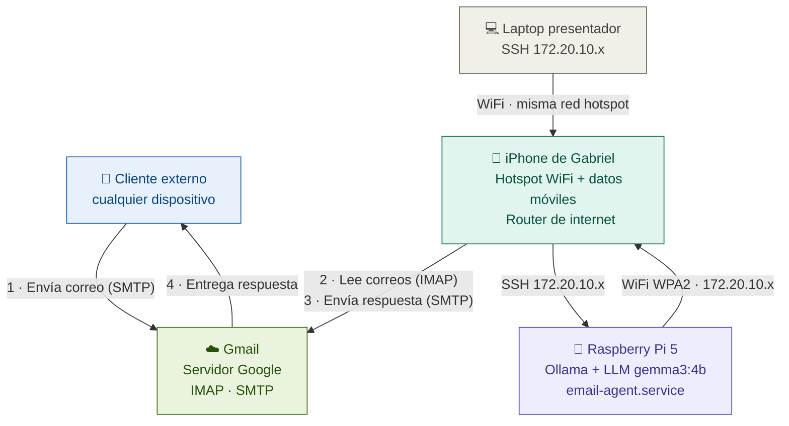
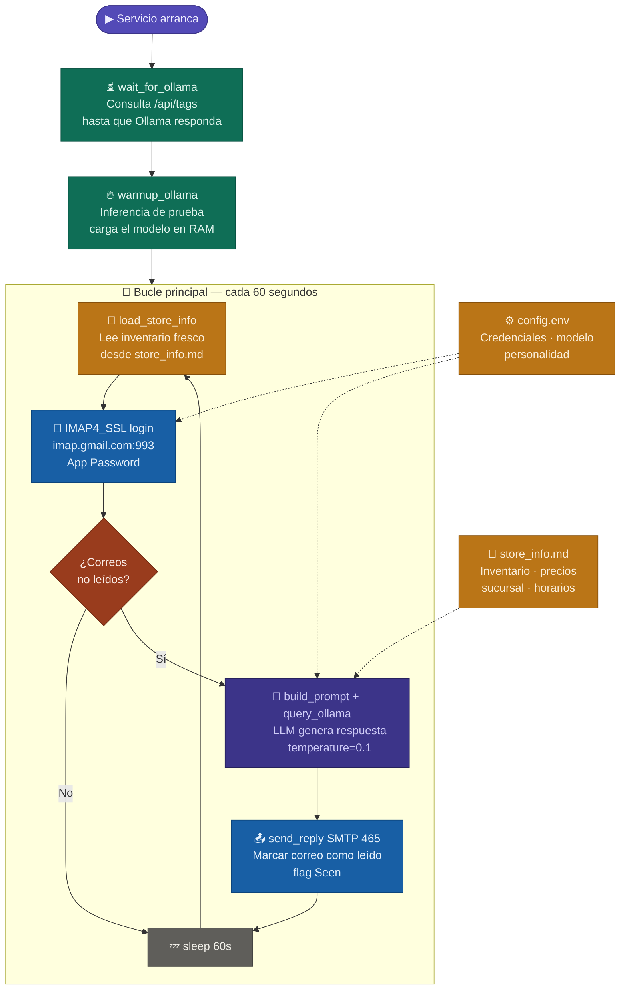

## Diagrama 1 — Infraestructura de red

```mermaid
flowchart TD
    CLIENTE["📧 Cliente externo
    cualquier dispositivo"]

    GMAIL["☁️ Gmail
    Servidor Google
    IMAP · SMTP"]

    IPHONE["📱 iPhone de Gabriel
    Hotspot WiFi + datos móviles
    Router de internet"]

    PI["🔴 Raspberry Pi 5
    Ollama + LLM gemma3:4b
    email-agent.service"]

    LAPTOP["💻 Laptop presentador
    SSH 172.20.10.x"]

    CLIENTE -- "1 · Envía correo (SMTP)" --> GMAIL
    GMAIL -- "4 · Entrega respuesta" --> CLIENTE

    PI -- "WiFi WPA2 · 172.20.10.x" --> IPHONE
    IPHONE -- "2 · Lee correos (IMAP)
    3 · Envía respuesta (SMTP)" --> GMAIL

    LAPTOP -- "WiFi · misma red hotspot" --> IPHONE
    IPHONE -- "SSH 172.20.10.x" --> PI

    style CLIENTE fill:#E6F1FB,stroke:#185FA5,color:#0C447C
    style GMAIL   fill:#EAF3DE,stroke:#3B6D11,color:#27500A
    style IPHONE  fill:#E1F5EE,stroke:#0F6E56,color:#085041
    style PI      fill:#EEEDFE,stroke:#534AB7,color:#3C3489
    style LAPTOP  fill:#F1EFE8,stroke:#5F5E5A,color:#444441
```

---

## Diagrama 2 — Agente Python

```mermaid
flowchart TD
    A(["▶ Servicio arranca"]):::start

    B["⏳ wait_for_ollama
    Consulta /api/tags
    hasta que Ollama responda"]:::init

    C["🔥 warmup_ollama
    Inferencia de prueba
    carga el modelo en RAM"]:::init

    subgraph LOOP["🔄 Bucle principal — cada 60 segundos"]
        D1["📄 load_store_info
        Lee inventario fresco
        desde store_info.md"]:::file

        D2["🔐 IMAP4_SSL login
        imap.gmail.com:993
        App Password"]:::net

        D3{"¿Correos
        no leídos?"}:::decision

        D4["💤 sleep 60s"]:::sleep

        D5["🤖 build_prompt + query_ollama
        LLM genera respuesta
        temperature=0.1"]:::llm

        D6["📤 send_reply SMTP 465
        Marcar correo como leído
        flag Seen"]:::net

        D1 --> D2 --> D3
        D3 -- "No" --> D4 --> D1
        D3 -- "Sí" --> D5 --> D6 --> D4
    end

    CONFIG["⚙️ config.env
    Credenciales · modelo
    personalidad"]:::file

    STORE["🏪 store_info.md
    Inventario · precios
    sucursal · horarios"]:::file

    A --> B --> C --> LOOP
    CONFIG -.-> D2
    CONFIG -.-> D5
    STORE  -.-> D5

    classDef start    fill:#534AB7,stroke:#3C3489,color:#EEEDFE
    classDef init     fill:#0F6E56,stroke:#085041,color:#E1F5EE
    classDef net      fill:#185FA5,stroke:#0C447C,color:#E6F1FB
    classDef llm      fill:#3C3489,stroke:#26215C,color:#CECBF6
    classDef file     fill:#BA7517,stroke:#854F0B,color:#FAEEDA
    classDef decision fill:#993C1D,stroke:#712B13,color:#FAECE7
    classDef sleep    fill:#5F5E5A,stroke:#444441,color:#F1EFE8
```